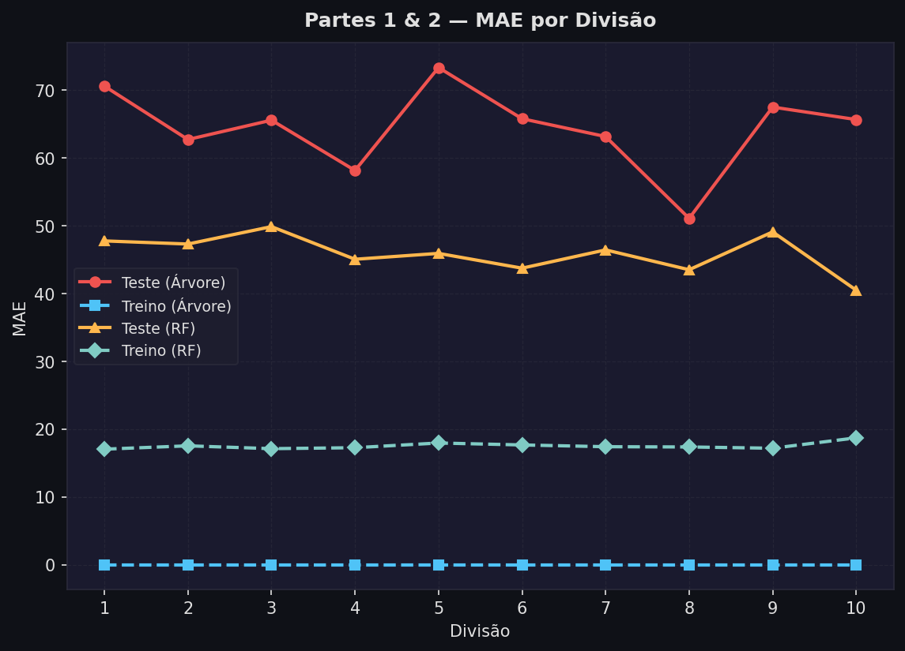
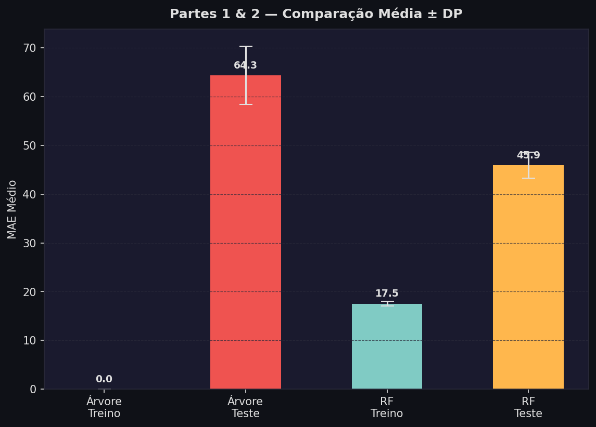
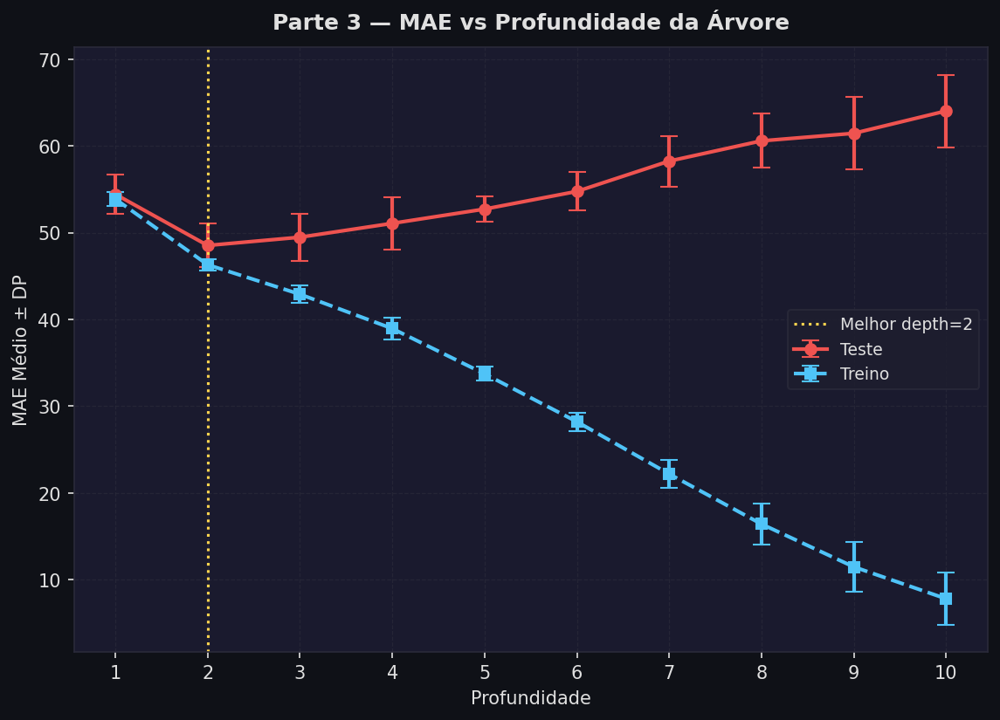
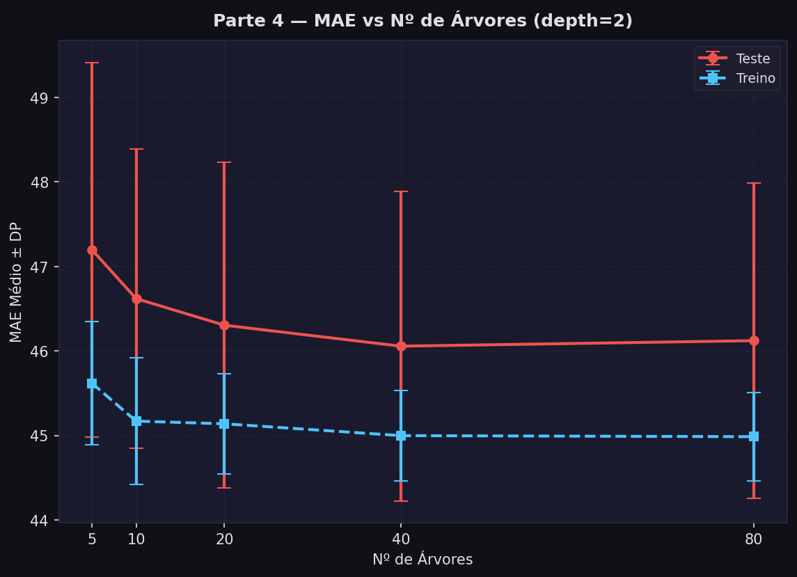

# ArvoreDecisao

Projeto para experimentar e visualizar modelos de árvore de decisão aplicados a conjuntos de dados.

**Descrição**
- **Objetivo:** implementar, testar e gerar gráficos que mostrem o desempenho de árvores de decisão.

**Como executar**
Instale as dependências (se necessário):

```bash
pip install -r requirements.txt
```

Executar os experimentos e gerar os gráficos:

```bash
python main.py
python graficos.py
```

**Visualizações (gráficos)**
As imagens abaixo foram geradas pelos scripts do projeto e estão na pasta `graficos/`.

- **MAE por divisão:**
	

- **Comparação de médias:**
	

- **Profundidade do modelo:**
	

- **Número de árvores vs. desempenho:**
	